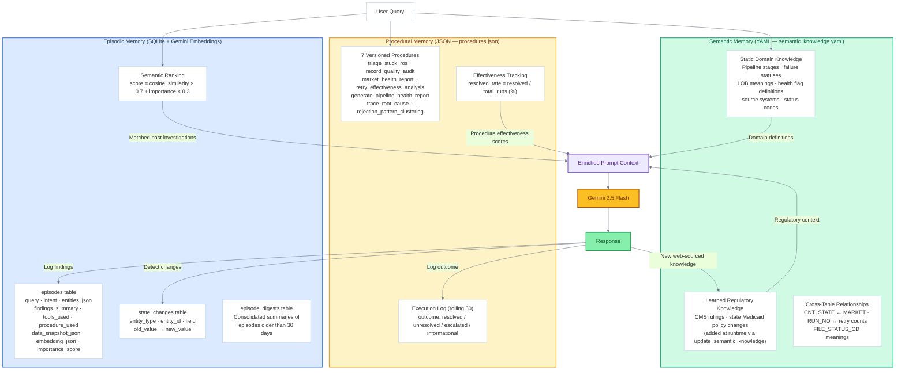
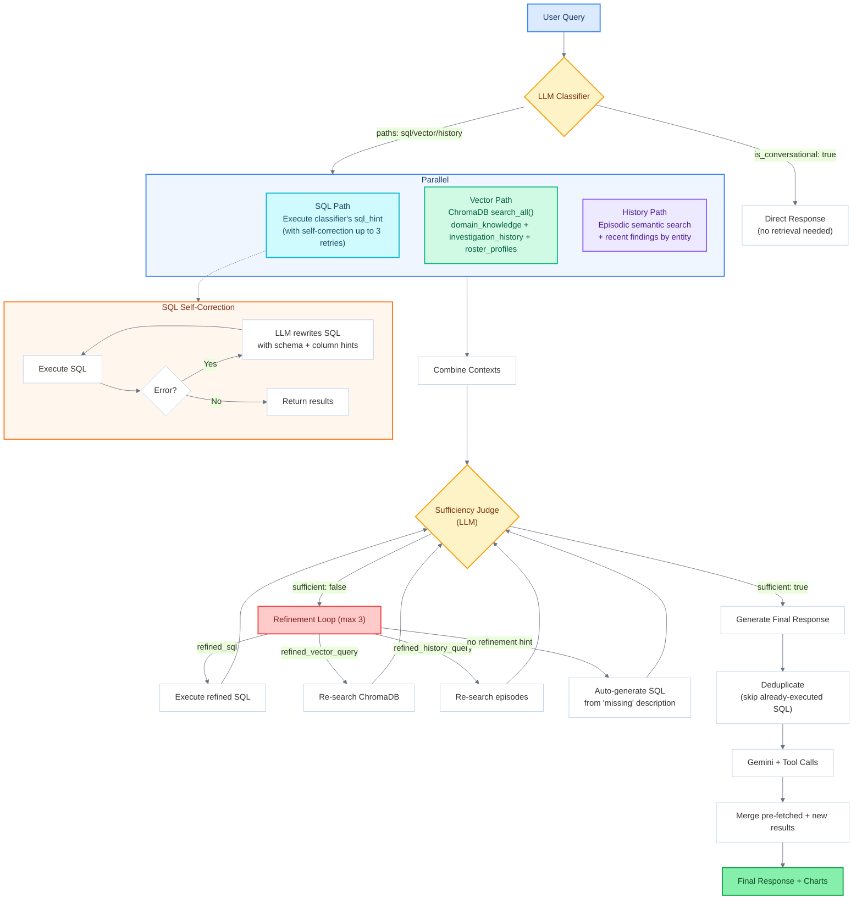

# RosterIQ — AI-Powered Healthcare Roster Pipeline Intelligence

RosterIQ is a conversational AI agent that monitors, diagnoses, and explains healthcare provider roster processing pipelines. It combines sub-millisecond DuckDB analytics, a three-tier cognitive memory system, Gemini 2.5 Flash function-calling, and an adaptive procedural playbook to surface stuck ROs, failing markets, retry inefficiencies, and compliance risks — and **remembers what it found** so every future query builds on past investigations.

**Team:** Zopita &nbsp;|&nbsp; [Pradipta Sundar Sahoo](https://github.com/Pradipta-Sundar-Sahoo) &nbsp;·&nbsp; [Dhruv Khandelwal](https://github.com/dhruv-k1)

---

Demo Youtube Video link- [YT LINK](https://youtu.be/eeeWLEMQySw)
## Table of Contents

- [Problem Statement](#problem-statement)
- [Architecture Overview](#architecture-overview)
- [Agent Routing](#agent-routing)
- [Agent Tools](#agent-tools)
- [Data Preprocessing Pipeline](#data-preprocessing-pipeline)
- [Enriched Data Model](#enriched-data-model)
- [DuckDB Tables](#duckdb-tables)
- [Three-Tier Memory System](#three-tier-memory-system)
- [Diagnostic Procedures](#diagnostic-procedures)
- [Multi-Path Query Pipeline](#multi-path-query-pipeline)
- [Visualization Engine](#visualization-engine)
- [Root Cause Reasoning](#root-cause-reasoning)
- [Procedural Learning Visibility](#procedural-learning-visibility)
- [Key Design Decisions](#key-design-decisions)
- [Tech Stack](#tech-stack)
- [Project Structure](#project-structure)
- [Getting Started](#getting-started)

---

## Problem Statement

Healthcare payers receive thousands of provider roster files monthly from source systems (AvailityPDM, DPE, PDM, MedEnroll, etc.). Each file passes through a **7-stage processing pipeline**:

```
PRE_PROCESSING → MAPPING_APPROVAL → ISF_GENERATION → DART_GENERATION → DART_REVIEW → DART_UI_VALIDATION → SPS_LOAD
```

Files can get **stuck**, **fail validation**, or **degrade market SCS%** (Transaction Success Rate). Operators need to:

- Triage stuck ROs by priority (critical / high / medium / low)
- Identify root causes of failures (data quality? compliance? timeout? source system?)
- Track market health trends across months
- Understand retry effectiveness (does re-processing actually fix things?)
- Correlate failures with LOB type (Medicare HMO vs Commercial PPO vs Medicaid FFS)
- Remember past investigations to avoid redundant diagnostic work

RosterIQ automates all of this through conversational AI with persistent memory, statistical root cause reasoning, and versioned playbooks that improve over time.

---

## Architecture Overview

```mermaid
%%{init: {'theme': 'base', 'themeVariables': {'primaryColor': '#DBEAFE', 'background': '#FFFFFF', 'mainBkg': '#FFFFFF', 'lineColor': '#6B7280', 'textColor': '#1F2937'}}}%%
graph TB
    subgraph Frontend["Frontend (Next.js 16 + React 19)"]
        Chat["/chat — Conversational AI"]
        Dashboard["/dashboard — Pipeline Overview"]
        MemoryUI["/memory — Memory Browser"]
    end

    subgraph Backend["Backend (FastAPI)"]
        Supervisor["Supervisor Agent"]
        Pipeline["Query Pipeline"]
        PipelineAgent["Pipeline Agent<br/>(Triage / Health)"]
        QualityAgent["Quality Agent<br/>(Failures / Metrics)"]
        Formatter["Formatter Agent"]
        LLMProvider["Gemini 2.5 Flash"]
    end

    subgraph Memory["Three-Tier Memory"]
        Episodic["Episodic Memory<br/>(SQLite + Embeddings)"]
        Procedural["Procedural Memory<br/>(JSON Procedures)"]
        Semantic["Semantic Memory<br/>(YAML Domain Knowledge)"]
    end

    subgraph Tools["Agent Tools"]
        T1["query_data<br/>(DuckDB SQL)"]
        T2["web_search<br/>(Tavily)"]
        T3["run_procedure"]
        T4["create_chart<br/>(Plotly)"]
        T5["recall_memory"]
        T6["update_procedure"]
        T7["update_semantic_knowledge"]
    end

    subgraph Data["Data Layer"]
        DuckDB["DuckDB (In-Memory)<br/>roster · metrics · state_summary<br/>org_summary · stage_health_summary"]
        ChromaDB["ChromaDB (Vector Store)<br/>3 collections"]
        Tavily["Tavily Web Search"]
    end

    subgraph DataSources["Raw Data"]
        CSV1["roster_processing_details.csv"]
        CSV2["aggregated_operational_metrics.csv"]
    end

    Chat --> Supervisor
    Dashboard --> Supervisor
    Supervisor --> Pipeline
    Supervisor --> PipelineAgent
    Supervisor --> QualityAgent
    Pipeline --> LLMProvider
    PipelineAgent --> LLMProvider
    QualityAgent --> LLMProvider
    LLMProvider --> Formatter

    Supervisor --> Episodic
    Supervisor --> Procedural
    Supervisor --> Semantic

    PipelineAgent --> T1
    PipelineAgent --> T3
    PipelineAgent --> T4
    QualityAgent --> T1
    QualityAgent --> T2
    QualityAgent --> T3
    QualityAgent --> T4
    QualityAgent --> T7
    Supervisor --> T1
    Supervisor --> T2
    Supervisor --> T3
    Supervisor --> T4
    Supervisor --> T5
    Supervisor --> T6
    Supervisor --> T7

    T1 --> DuckDB
    T2 --> Tavily
    T3 --> Procedural
    T5 --> Episodic
    T6 --> Procedural
    T7 --> Semantic

    CSV1 --> DuckDB
    CSV2 --> DuckDB
    Semantic --> ChromaDB

    style Frontend fill:#DBEAFE,stroke:#3B82F6,stroke-width:2px,color:#1E3A5F
    style Backend fill:#FEF3C7,stroke:#F59E0B,stroke-width:2px,color:#78350F
    style Memory fill:#D1FAE5,stroke:#10B981,stroke-width:2px,color:#065F46
    style Tools fill:#E0E7FF,stroke:#6366F1,stroke-width:2px,color:#312E81
    style Data fill:#EDE9FE,stroke:#8B5CF6,stroke-width:2px,color:#4C1D95
    style DataSources fill:#FEE2E2,stroke:#EF4444,stroke-width:2px,color:#7F1D1D
```



---

## Agent Routing

Every incoming message passes through the Supervisor, which uses regex entity extraction and keyword-based intent detection to route the request to the most appropriate specialist.

```mermaid
%%{init: {'theme': 'base', 'themeVariables': {'primaryColor': '#DBEAFE', 'background': '#FFFFFF', 'mainBkg': '#FFFFFF', 'lineColor': '#6B7280', 'textColor': '#1F2937'}}}%%
flowchart LR
    Query["User Query"] --> Supervisor["Supervisor"]
    Supervisor --> Extract["Entity Extraction<br/>(Regex &lt;1ms)<br/>states · RO IDs · procedures"]
    Extract --> Intent{"Intent?"}

    Intent -->|triage / stuck / critical| PA["Pipeline Agent"]
    Intent -->|audit / report / analysis / quality| QA["Quality Agent"]
    Intent -->|memory / before / history / past| RM["recall_memory"]
    Intent -->|update / modify / add to procedure| UP["update_procedure"]
    Intent -->|general / other| QP["Query Pipeline"]

    PA --> PATools["Tools: query_data, run_procedure, create_chart"]
    QA --> QATools["Tools: query_data, run_procedure, create_chart,<br/>web_search, update_semantic_knowledge"]
    QP --> Classify["LLM Classifier<br/>(paths: sql, vector, history)"]

    Classify --> SQL["SQL Path"]
    Classify --> Vector["Vector Path (ChromaDB)"]
    Classify --> History["History Path (Episodic)"]

    SQL --> Combine["Combine Contexts"]
    Vector --> Combine
    History --> Combine

    Combine --> Judge{"Sufficiency<br/>Judge (LLM)"}
    Judge -->|No, up to 3x| Refine["Refinement Loop"]
    Refine --> Judge
    Judge -->|Yes| Generate["Generate Response"]

    PATools --> Format["Formatter Agent"]
    QATools --> Format
    Generate --> Format
    Format --> Response["Final Response + Charts + Memory Updates"]

    style Query fill:#DBEAFE,stroke:#3B82F6,stroke-width:2px,color:#1E3A5F
    style Supervisor fill:#FDE68A,stroke:#D97706,stroke-width:2px,color:#78350F
    style Extract fill:#E0E7FF,stroke:#6366F1,stroke-width:2px,color:#312E81
    style Intent fill:#FEF3C7,stroke:#F59E0B,stroke-width:2px,color:#78350F
    style PA fill:#FECACA,stroke:#EF4444,stroke-width:2px,color:#7F1D1D
    style QA fill:#FED7AA,stroke:#F97316,stroke-width:2px,color:#7C2D12
    style QP fill:#FDE68A,stroke:#EAB308,stroke-width:2px,color:#713F12
    style RM fill:#E0E7FF,stroke:#6366F1,stroke-width:2px,color:#312E81
    style UP fill:#D1FAE5,stroke:#10B981,stroke-width:2px,color:#065F46
    style PATools fill:#E0E7FF,stroke:#6366F1,stroke-width:2px,color:#312E81
    style QATools fill:#E0E7FF,stroke:#6366F1,stroke-width:2px,color:#312E81
    style Format fill:#FDE68A,stroke:#EAB308,stroke-width:2px,color:#713F12
    style Response fill:#86EFAC,stroke:#16A34A,stroke-width:2px,color:#14532D
```



---

## Agent Tools

| Tool | Description | Parameters | Used By |
|------|-------------|-----------|---------|
| `query_data` | Execute a SELECT query on DuckDB with schema-aware self-correction (up to 3 retries) | `sql: string` | All agents |
| `web_search` | Search the web for regulatory, org, or compliance context via Tavily | `query: string`, `search_type: regulatory\|org\|compliance\|lob\|general` | Quality Agent, Supervisor |
| `run_procedure` | Execute a named diagnostic procedure from procedural memory | `procedure_name: string`, `params: JSON string` | All agents |
| `create_chart` | Generate a Plotly chart JSON by type | `chart_type: string`, `params: JSON string` | All agents |
| `recall_memory` | Semantic search over past episodic investigations | `search_text: string` | Supervisor |
| `update_procedure` | Add steps or modify an existing procedure; version-tracked with change record | `procedure_name`, `change_description`, `new_step: JSON` | Supervisor |
| `update_semantic_knowledge` | Persist new domain or regulatory knowledge to YAML + ChromaDB | `category`, `key`, `value`, `reason` | Quality Agent, Supervisor |

---

## Data Preprocessing Pipeline

Raw CSVs are loaded into DuckDB at server startup and transformed through a 4-step pipeline. All enriched columns are pre-computed so the LLM only needs to write simple `SELECT col FROM table WHERE col = value` queries rather than complex inline derivations.

```mermaid
%%{init: {'theme': 'base', 'themeVariables': {'primaryColor': '#DBEAFE', 'background': '#FFFFFF', 'mainBkg': '#FFFFFF', 'lineColor': '#6B7280', 'textColor': '#1F2937'}}}%%
flowchart TD
    subgraph Raw["Step 1 — Load Raw CSVs"]
        R1["roster_processing_details.csv → raw_roster"]
        R2["aggregated_operational_metrics.csv → raw_metrics"]
    end

    subgraph Normalize["Step 2 — Normalize & Standardize"]
        N1["Column Renames<br/>AVG_DART_GENERATION_DURATION → AVG_DART_GEN_DURATION<br/>AVG_ISF_GENERATION_DURATION → AVG_ISF_GEN_DURATION<br/>AVG_DART_UI_VLDTN_DURATION → AVG_DART_UI_VALIDATION_DURATION"]
        N2["Categorical Normalization<br/>All health flags → UPPERCASE<br/>FAILURE_STATUS → UPPER + TRIM<br/>Stage name: DART_GENERATION → DART_GEN"]
        N3["Type Casting<br/>FILE_STATUS_CD → INTEGER"]
    end

    subgraph Enrich["Step 3 — Feature Engineering (15+ columns)"]
        E1["Triage Priority<br/>CRITICAL: DAYS_STUCK > 90 AND RED_COUNT ≥ 2<br/>HIGH: DAYS_STUCK > 30 OR RED_COUNT ≥ 2<br/>MEDIUM: DAYS_STUCK > 7<br/>LOW: everything else"]
        E2["LOB Decomposition<br/>LOB_PRIMARY · LOB_CATEGORIES · LOB_COUNT<br/>LOB_PLAN_TYPE (HMO/PPO/EPO/FFS/INDEMNITY/UNSPECIFIED)<br/>LOB_COMPLIANCE_RISK (HIGHEST → LOW)<br/>HAS_MEDICARE · HAS_MEDICAID · HAS_COMMERCIAL"]
        E3["Failure Classification<br/>FAILURE_CATEGORY:<br/>NONE / VALIDATION / TIMEOUT<br/>PROCESSING / COMPLIANCE / OTHER"]
        E4["Health Aggregation<br/>RED_COUNT · YELLOW_COUNT (0–7 each)<br/>HEALTH_SCORE (GREEN=2, YELLOW=1, RED=0, max=14)<br/>WORST_HEALTH_STAGE (last-stage-first RED scan)"]
        E5["Pipeline Ordering<br/>PIPELINE_STAGE_ORDER: –2 (INGESTION) to 7 (RESOLVED)"]
        E6["Metrics Enrichment<br/>RETRY_LIFT_PCT · OVERALL_FAIL_RATE<br/>FIRST_ITER_FAIL_RATE · RETRY_RESOLUTION_RATE<br/>TOT_REC_CNT · SCS/FAIL/REJ_REC_RATIO<br/>IS_BELOW_SLA · MONTH_DATE"]
    end

    subgraph Summary["Step 4 — Aggregate Summary Tables"]
        S1["state_summary<br/>Per CNT_STATE: TOTAL_ROS, STUCK_COUNT, FAILED_COUNT,<br/>FAILURE_RATE, AVG_DAYS_STUCK, CRITICAL_COUNT,<br/>AVG_RED_COUNT, AVG_HEALTH_SCORE, TOP_FAILING_ORG"]
        S2["org_summary<br/>Per (ORG_NM, CNT_STATE): TOTAL_ROS, STUCK_COUNT,<br/>FAILED_COUNT, FAILURE_RATE, AVG_HEALTH_SCORE, CRITICAL_COUNT"]
        S3["stage_health_summary<br/>Per LATEST_STAGE_NM: RED/YELLOW/GREEN totals,<br/>AVG_RED_FLAGS, STUCK_IN_STAGE"]
    end

    Raw --> Normalize --> Enrich --> Summary
    Summary --> Schema["Build Schema Cache<br/>(for dynamic LLM prompt injection)"]
    Summary --> VectorIndex["Index org profiles into ChromaDB<br/>(roster_profiles collection)"]

    style Raw fill:#FEE2E2,stroke:#EF4444,stroke-width:2px,color:#7F1D1D
    style Normalize fill:#FEF3C7,stroke:#F59E0B,stroke-width:2px,color:#78350F
    style Enrich fill:#DBEAFE,stroke:#3B82F6,stroke-width:2px,color:#1E3A5F
    style Summary fill:#D1FAE5,stroke:#10B981,stroke-width:2px,color:#065F46
    style Schema fill:#EDE9FE,stroke:#8B5CF6,stroke-width:2px,color:#4C1D95
    style VectorIndex fill:#EDE9FE,stroke:#8B5CF6,stroke-width:2px,color:#4C1D95
```



---

## Enriched Data Model

### roster table (individual RO records)

| Column | Derived From | Meaning |
|--------|-------------|---------|
| `DAYS_STUCK` | `DATEDIFF('day', FILE_RECEIVED_DT, NOW())` | Age of unresolved file |
| `RED_COUNT` | Sum of 7 health flags = RED | Number of failed pipeline stages |
| `YELLOW_COUNT` | Sum of 7 health flags = YELLOW | Number of warning stages |
| `HEALTH_SCORE` | GREEN=2, YELLOW=1, RED=0 per flag, summed | Overall health (0–14, 14=fully green) |
| `PRIORITY` | `DAYS_STUCK` + `RED_COUNT` thresholds | Triage rank: CRITICAL / HIGH / MEDIUM / LOW |
| `IS_RETRY` | `RUN_NO > 1` | Whether this is a reprocessing attempt |
| `LOB_PRIMARY` | First token of LOB list | Quick LOB lookup |
| `LOB_PLAN_TYPE` | Pattern match: HMO / PPO / EPO / FFS / INDEMNITY | Plan structure classification |
| `LOB_COMPLIANCE_RISK` | Medicare HMO=HIGHEST → Commercial=LOW | Regulatory risk tier |
| `FAILURE_CATEGORY` | Keyword match on FAILURE_STATUS | Structured taxonomy for root cause |
| `WORST_HEALTH_STAGE` | First RED stage (scanned SPS_LOAD → PRE_PROCESSING) | Bottleneck stage |
| `PIPELINE_STAGE_ORDER` | Stage name → integer –2 to 7 | Enables stage-progression queries |

### metrics table (market-level monthly aggregates)

| Column | Derived From | Meaning |
|--------|-------------|---------|
| `RETRY_LIFT_PCT` | `(NEXT_ITER_SCS – FIRST_ITER_SCS) / FIRST_ITER_SCS × 100` | How much retrying improved success rate |
| `RETRY_RESOLUTION_RATE` | `(NEXT_ITER_SCS – FIRST_ITER_SCS) / FIRST_ITER_FAIL × 100` | % of first-iteration failures recovered by retry |
| `TOT_REC_CNT` | `OVERALL_SCS + OVERALL_FAIL` | Total records processed |
| `SCS_REC_RATIO` | `OVERALL_SCS / TOT_REC_CNT × 100` | Overall success rate |
| `FAIL_REC_RATIO` | `OVERALL_FAIL / TOT_REC_CNT × 100` | Overall failure rate |
| `IS_BELOW_SLA` | `SCS_PERCENT < 95` | SLA breach flag (95% threshold) |
| `MONTH_DATE` | `STRPTIME(MONTH, '%m-%Y')` | Sortable timestamp from MM-YYYY string |

### Summary tables

| Table | Granularity | Key Metrics |
|-------|------------|------------|
| `state_summary` | Per state | TOTAL_ROS, STUCK_COUNT, FAILED_COUNT, FAILURE_RATE, AVG_DAYS_STUCK, CRITICAL_COUNT, TOP_FAILING_ORG |
| `org_summary` | Per org × state | TOTAL_ROS, STUCK_COUNT, FAILED_COUNT, FAILURE_RATE, AVG_HEALTH_SCORE, CRITICAL_COUNT |
| `stage_health_summary` | Per pipeline stage | RED_COUNT_TOTAL, YELLOW_COUNT_TOTAL, AVG_RED_FLAGS, STUCK_IN_STAGE |

---

## Three-Tier Memory System

RosterIQ implements a **cognitive memory architecture** inspired by human memory. Each tier serves a distinct purpose and improves quality over time.



### Episodic Memory — "What did we find before?"

| Mechanism | How It Helps |
|-----------|-------------|
| **Semantic search** | Query is embedded with Gemini `text-embedding-004`. Past episodes are ranked: `cosine_similarity × 0.7 + importance_score × 0.3`. Episodes involving web search, procedures, or critical findings get higher importance. |
| **Data snapshots** | Every episode stores a full pipeline snapshot (stuck ROs by state, failed counts, top orgs). Session briefings compare current vs previous snapshot to surface changes ("3 stuck ROs resolved in TX since last session"). |
| **State change detection** | Detects changes across `stuck_by_state`, `failed_by_state`, `red_flag_by_state`, `scs_percent_by_state`, `top_failing_org_by_state`. Changes are logged with `old_value → new_value` and a narrative description. |
| **Consolidation** | Episodes older than 30 days are LLM-summarized into `episode_digests`, keeping search fast while retaining long-term patterns. |

### Procedural Memory — "What workflow should I follow?"

| Mechanism | How It Helps |
|-----------|-------------|
| **Versioned playbooks** | Each procedure has `version`, `steps`, `parameters`, `modification_history`, and `execution_log`. The LLM can read current version and full change history. |
| **Effectiveness tracking** | `resolved_rate = resolved_count / total_runs`. Injected into the LLM prompt so it can recommend procedures that have historically worked. |
| **Runtime learning** | When the user says "also check LOB compliance risk during triage", `update_procedure` adds the step and bumps the version. The UI shows exactly what changed and why (see [Procedural Learning Visibility](#procedural-learning-visibility)). |

### Semantic Memory — "What does this term mean?"

| Mechanism | How It Helps |
|-----------|-------------|
| **Static domain injection** | Pipeline stage descriptions, health flag meanings, LOB compliance hierarchies, source system info — all injected into every LLM prompt. The model never needs to guess. |
| **Runtime learning** | `update_semantic_knowledge` writes new entries to the YAML and re-indexes them in ChromaDB's `domain_knowledge` collection. Future queries automatically include this context. |
| **Cross-table relationships** | Semantic memory stores how `roster.CNT_STATE` maps to `metrics.MARKET`, what `RUN_NO` means, etc. This significantly reduces LLM SQL join errors. |

---

## Diagnostic Procedures

Procedures are versioned playbooks stored in `memory/procedures.json`. The engine in `procedures/engine.py` dispatches each procedure to a dedicated Python executor.

| Procedure | Purpose | Key Output |
|-----------|---------|-----------|
| `triage_stuck_ros` | Find all stuck ROs ranked by `DAYS_STUCK + RED_COUNT`. Returns CRITICAL → LOW priority groups. | Stuck count, priority breakdown, stuck_tracker chart |
| `record_quality_audit` | Failure rates per state and org. Flags states/orgs below configurable threshold. | Failure stats, flagged orgs list |
| `market_health_report` | SCS% trends per market, correlation with file failure rates. | Market trend chart, below-SLA markets |
| `retry_effectiveness_analysis` | Compare `FIRST_ITER_SCS_CNT` vs `NEXT_ITER_SCS_CNT`. Computes `RETRY_LIFT_PCT` per market. | Retry lift chart, markets where retrying doesn't help |
| `generate_pipeline_health_report` | Full report: stage health heatmap, state summary, bottleneck analysis, recommended actions. | Health heatmap + state summary table |
| `trace_root_cause` | Deep statistical root cause analysis — see [Root Cause Reasoning](#root-cause-reasoning). | Stage blame scores, driver scores, ranked causal chain |
| `rejection_pattern_clustering` | Cluster failures by `FAILURE_CATEGORY × ORG_NM × LOB` to find systemic patterns. | Failure pattern table, top clusters |

### Procedure Execution Flow

```
run_procedure(name, params)
  ↓
engine.execute_procedure(name, params)
  ↓
_execute_{name}()  [dedicated Python function]
  ↓
DuckDB queries + Python analytics
  ↓
Plotly chart generation
  ↓
{summary, data, chart, ...}
  ↓
log_execution(name, params, outcome, session_id)  [rolling 50 entries]
```

---

## Multi-Path Query Pipeline

The query pipeline routes general queries through parallel retrieval, a sufficiency judge, and up to 3 refinement loops before generating the final response.



### ChromaDB Collections

| Collection | Contents | Populated From | Purpose |
|-----------|----------|---------------|---------|
| `domain_knowledge` | Pipeline stages, failure statuses, LOB meanings, health flags, source systems, status codes, cross-table relationships | `semantic_knowledge.yaml` (at startup + runtime) | Semantic lookup of domain concepts |
| `investigation_history` | Past query + findings pairs | Episodic memory (after every query) | Surface similar past investigations |
| `roster_profiles` | Org-level summaries: total ROs, failure rate, health score per org × state | `org_summary` table (at startup) | Natural language org lookup |

---

## Visualization Engine

Six Plotly chart types are available via the `create_chart` tool or the `/dashboard/charts/` REST endpoints. All charts serialize to JSON and render in the frontend using `react-plotly.js`.

| Chart Type | Function | What It Shows | Data Source |
|-----------|----------|--------------|------------|
| `health_heatmap` | `create_health_heatmap(df)` | Org × 7 pipeline stages colored GREEN/YELLOW/RED (numeric 0–2) | `roster` — top 30 orgs |
| `failure_breakdown` | `create_failure_breakdown(stats_df, failure_df)` | Stacked bar of failure types per state; or failure rate bars per state | `roster` grouped by `FAILURE_STATUS` and `CNT_STATE` |
| `duration_anomaly` | `create_duration_anomaly(df)` | Actual vs avg duration scatter with 2× anomaly threshold line | `roster` — DART_GEN, ISF_GEN, SPS_LOAD durations |
| `market_trend` | `create_market_trend(df, market)` | Monthly SCS% line chart per market with 95% SLA threshold | `metrics` ordered by `MONTH_DATE` |
| `retry_lift` | `create_retry_lift(df)` | Stacked bar: First Iteration Success + Retry Recovery per market | `metrics` latest month per market (sorted by `MONTH_DATE`) |
| `stuck_tracker` | `create_stuck_tracker(df)` | Scatter of stuck ROs by org, sized by RED_COUNT, colored by PRIORITY | `roster WHERE IS_STUCK=1` |

> **Note:** All temporal queries use `ORDER BY MARKET, MONTH_DATE` (not `MONTH`) to ensure correct chronological ordering across years when the string is in `MM-YYYY` format.

---

## Root Cause Reasoning

The `trace_root_cause` procedure performs **statistical correlation analysis** across multiple dimensions to identify the true drivers of pipeline failures, rather than just returning top-N lists.

### Analysis Dimensions

```
1. Market SCS Trend
   → Latest SCS%, month-over-month change, 3-month trend direction

2. Baseline Failure Stats
   → total_ros, total_failed, baseline_fail_rate for target market/state

3. Stage Blame Scores  (UNION ALL across 7 health columns)
   → blame_pct = % of failed ROs with RED at each stage
   → lift = (failed_with_red/total_failed) / (total_red/total_ros)
   → Stages ranked by blame_pct × lift

4. Source System Driver Scores
   → Per SRC_SYS: failure_rate, share_of_failures
   → driver_score = √(failure_rate × share_of_failures)  [geometric mean]
   → Python-computed lift = (sys_fail/sys_total) / (total_fail/total_ros)
   → Confidence: HIGH if lift > 2, MEDIUM if > 1.2

5. LOB Driver Scores
   → Same geometric mean + lift pattern applied to LOB_PRIMARY
   → try/except fallback if column missing

6. Retry Pattern Impact
   → target market retry success rate vs global average
   → Identifies if retrying is masking or resolving failures

7. Cross-Dimension Hotspots  (SRC_SYS × LATEST_STAGE_NM matrix)
   → Failure rate at each source system × stage intersection
   → Surfaces specific "X from system Y always fails at stage Z" patterns

8. Ranked Drivers List
   → Unified ranking across stage, source, LOB dimensions
   → Sorted by driver_score, labeled with confidence tier

9. SCS Decline Context
   → trend: declining / stable / improving
   → Month-over-month acceleration of decline

10. Causal Chain Narrative
    → Synthesizes all above into ordered root causes with severity
```

The same correlation logic also runs in `cross_table_state_analysis()` in `tools/data_query.py` for any ad-hoc state-level cross-table queries triggered by the LLM.

---

## Procedural Learning Visibility

When the LLM calls `update_procedure` in response to user feedback, the change is now visible end-to-end across all 4 layers:

```
1. procedural.py:update_procedure()
   → Records {from_version, to_version, changes, timestamp} in modification_history
   → Returns {procedure, old_version, new_version, changes}

2. supervisor.py:handle()
   → Detects tool_name == "update_procedure" && "new_version" in result
   → Appends to procedure_updates list: {procedure_name, old_version, new_version, changes, change_description}

3. main.py:/chat endpoint
   → procedure_updates passed through ChatResponse Pydantic model

4. chat/page.tsx — ProcedureLearningCard component (emerald theme)
   → Header: Sparkles icon + "Procedural Learning — N procedure(s) updated"
   → Expanded: version pill (v1 → v2), "What changed" bullet list, "Why" from change_description
```

This makes the agent's self-improvement transparent — users can see exactly what the agent learned from their feedback.

---

## Key Design Decisions

### Why DuckDB over Pandas or SQLite

LLMs generate SQL far more reliably than Pandas code. DuckDB was chosen over SQLite for its analytical SQL features (`LIST_TRANSFORM`, `STRING_SPLIT`, `ILIKE`, complex `CREATE TABLE AS SELECT`) and in-memory mode (`:memory:`) for zero-infrastructure sub-millisecond queries. The DB reloads from CSVs on every restart so preprocessing changes never require schema migrations.

### Why Pre-compute 15+ Enriched Columns

When asking Gemini to compute `PRIORITY`, `FAILURE_CATEGORY`, `LOB_COMPLIANCE_RISK`, or multi-column `HEALTH_SCORE` inline, it failed 40–60% of the time. Pre-computing during DuckDB table creation reduces LLM SQL to simple `SELECT col FROM table WHERE col = value` — which succeeds ~90% on the first attempt. With SQL self-correction, effective accuracy reaches ~98%.

### Why Geometric Mean for Driver Scores

`driver_score = √(failure_rate × share_of_failures)` ensures a source system must score on **both** dimensions to rank highly. A system with 100% failure rate but 0.1% share is less actionable than one with 30% failure rate and 30% share. Pure multiplication would be dominated by extremes; geometric mean produces balanced, actionable rankings.

### Why Regex Entity Extraction

Regex takes <1 ms vs 800–1500 ms for LLM extraction. It's deterministic — it never hallucinates entities. The entity space is bounded: 50 US state codes, RO IDs matching `RO-\d+`, and 7 procedure names. Regex handles all of these with 100% precision.

### Why the Sufficiency Judge + Refinement Loop

Single-pass retrieval fails for multi-faceted queries like "Why is TX SCS% dropping?" which needs metrics trends, failure breakdowns, episodic history, and possibly regulatory context. The sufficiency judge evaluates if the gathered context is sufficient, then generates targeted refinements. Empirically: ~70% sufficient after pass 1, ~90% after pass 2, ~97% after pass 3.

### Why SQL Self-Correction (Not Blind Retry)

The most common LLM SQL failure is wrong column names (`FAILURE_TYPE` instead of `FAILURE_CATEGORY`). Retrying the same prompt produces the same error. The self-correction mechanism extracts schema hints and fuzzy-matched column corrections from the error message, then resends with the full schema. Up to 3 attempts.

### Why SQLite for Episodic Memory (Not ChromaDB Alone)

Episodic memory requires both structured queries (filter by session ID, timestamp ranges, `COUNT(*)` for consolidation triggers) and semantic search. ChromaDB cannot do relational queries. The hybrid: SQLite handles all structured operations; Gemini `text-embedding-004` embeddings stored as JSON enable cosine-similarity search in Python.

### Why Three Separate ChromaDB Collections

Merging `domain_knowledge`, `investigation_history`, and `roster_profiles` into one collection would mix static definitions with growing investigation logs with org statistics. Separate collections ensure each search returns focused, type-appropriate results.

### Why Multi-Agent Architecture

A single agent with all 7 tool definitions + full schema + semantic knowledge + episodic context = 8000+ token system prompts, causing the LLM to ignore parts and confuse tools. Splitting into Supervisor (routing), Pipeline Agent (stuck ROs), Quality Agent (failures, metrics), and Formatter gives each agent a focused ~2000-token prompt.

### Why MONTH_DATE for Temporal Ordering

`MONTH` is stored as `MM-YYYY` strings. String comparison sorts `01-2024` before `12-2023` — reversing the timeline for multi-year datasets. All temporal queries use `ORDER BY MONTH_DATE` (a parsed `TIMESTAMP` added at preprocessing) to guarantee correct chronological ordering.

---

## Tech Stack

| Layer | Technology | Version | Purpose |
|-------|-----------|---------|---------|
| **LLM** | Google Gemini 2.5 Flash | `gemini-2.5-flash` | Reasoning, classification, SQL generation, formatting |
| **Embeddings** | Gemini text-embedding-004 | — | Episodic memory semantic search |
| **Backend** | FastAPI + Uvicorn | 0.115.6 / 0.34.0 | REST API server |
| **Analytical DB** | DuckDB (in-memory) | 1.1.3 | Sub-millisecond SQL on roster + metrics |
| **Vector DB** | ChromaDB (persistent) | ≥0.4.0 | Semantic retrieval: 3 collections |
| **Episodic Store** | SQLite | built-in | Past investigations, state changes, digests |
| **Web Search** | Tavily API | tavily-python 0.5.0 | Regulatory context, org info, compliance |
| **Charts** | Plotly (Python + JS) | 5.24.1 | Heatmaps, trend lines, scatter, bar charts |
| **Frontend** | Next.js 16 + React 19 | 16.1.6 / 19.2.3 | Chat UI, dashboard, memory browser |
| **Deployment** | Docker Compose | — | Two-container: backend:8000, frontend:3000 |

---

## Project Structure

```
Roaster-IQ/
├── backend/
│   ├── main.py                      # FastAPI app — all routes, lifespan initialization, Pydantic models
│   ├── data_loader.py               # CSV → DuckDB: 4-step enrichment pipeline, 5 tables
│   ├── query_pipeline.py            # Multi-path: classify → parallel retrieval → judge → refine → generate
│   ├── vector_store.py              # ChromaDB wrapper: domain_knowledge, investigation_history, roster_profiles
│   ├── schema_provider.py           # Dynamic schema cache: DESCRIBE queries at startup
│   ├── prompts.py                   # Supervisor and specialist agent system prompts
│   ├── prompts_pipeline.py          # Classifier and sufficiency judge prompts
│   ├── requirements.txt
│   ├── agents/
│   │   ├── supervisor.py            # Main orchestrator: routing, memory, tool execution, state-change detection
│   │   ├── pipeline_agent.py        # Specialist: stuck ROs, pipeline health, triage
│   │   ├── quality_agent.py         # Specialist: failures, market metrics, web search, regulatory
│   │   ├── formatter_agent.py       # Final response cleanup and consistency
│   │   └── llm_provider.py          # Gemini function-calling wrapper: model init, tool binding
│   ├── memory/
│   │   ├── episodic.py              # SQLite: episodes, state_changes, episode_digests; embedding search
│   │   ├── procedural.py            # JSON: versioned procedures, execution log, effectiveness stats
│   │   └── semantic.py              # YAML: domain knowledge, ChromaDB indexing
│   ├── tools/
│   │   ├── data_query.py            # DuckDB SQL execution, self-correction, cross_table_state_analysis
│   │   ├── visualizations.py        # Plotly chart generators (6 chart types → JSON)
│   │   ├── web_search.py            # Tavily: regulatory, org, compliance, LOB, general search
│   │   └── report_generator.py      # Full state/org pipeline health report builder
│   └── procedures/
│       └── engine.py                # Procedure executor dispatch + 7 dedicated _execute_*() functions
├── frontend/
│   ├── app/
│   │   ├── page.tsx                 # Root → redirects to /chat
│   │   ├── layout.tsx               # Root layout with sidebar navigation
│   │   ├── chat/page.tsx            # Chat UI: messages, tool cards, charts, procedure learning cards
│   │   ├── dashboard/page.tsx       # Overview + Charts tabs, filter controls, intelligence section
│   │   └── memory/page.tsx          # Three-tab memory browser: Episodic / Procedural / Semantic
│   ├── components/
│   │   ├── charts/PlotlyChart.tsx   # Plotly JSON → rendered chart component
│   │   ├── layout/Sidebar.tsx       # Navigation with route highlighting
│   │   └── ui/                      # shadcn/ui component library
│   └── lib/
│       ├── api.ts                   # All API functions + TypeScript interfaces
│       └── utils.ts                 # Utility helpers
├── memory/                          # Persistent memory storage (gitignored in production)
│   ├── procedures.json              # Versioned procedure definitions + execution logs
│   ├── semantic_knowledge.yaml      # Domain knowledge base (static + runtime-learned)
│   ├── episodic.db                  # SQLite: episodes, state_changes, digests
│   └── chroma_db/                   # ChromaDB persistence directory
├── data/
│   ├── roster_processing_details.csv
│   └── aggregated_operational_metrics.csv
├── docker-compose.yml               # backend:8000 + frontend:3000
└── .env                             # GEMINI_API_KEY, TAVILY_API_KEY, NEXT_PUBLIC_API_URL
```


## Getting Started

### Prerequisites

- Python 3.11+
- Node.js 18+
- Google Gemini API key (`GEMINI_API_KEY`)
- Tavily API key (`TAVILY_API_KEY`)

### Environment Setup

```bash
cd Roaster-IQ
cp .env.example .env
# Edit .env with your API keys:
# GEMINI_API_KEY=...
# TAVILY_API_KEY=...
# NEXT_PUBLIC_API_URL=http://localhost:8000  (or your backend URL)
```

### Option 1 — Docker Compose (recommended)

```bash
docker-compose up --build
```

Backend: `http://localhost:8000` | Frontend: `http://localhost:3000`

### Option 2 — Local Development

```bash
# Terminal 1: Backend
cd backend
pip install -r requirements.txt
uvicorn main:app --reload --port 8000

# Terminal 2: Frontend
cd frontend
npm install
npm run dev
```

### First-Run Behavior

On startup the backend:
1. Loads and enriches both CSVs into DuckDB (5 tables, 15+ derived columns)
2. Builds the schema cache for LLM prompt injection
3. Initializes ChromaDB (indexes domain knowledge + org profiles)
4. Migrates procedural memory (adds `execution_log` to legacy procedures)
5. Starts the FastAPI server on port 8000

If `memory/episodic.db` does not exist it is created fresh. If `memory/procedures.json` does not exist the default 7 procedures are seeded.
