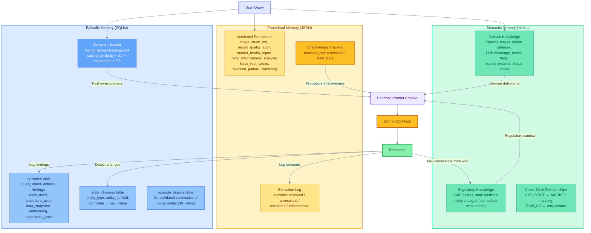
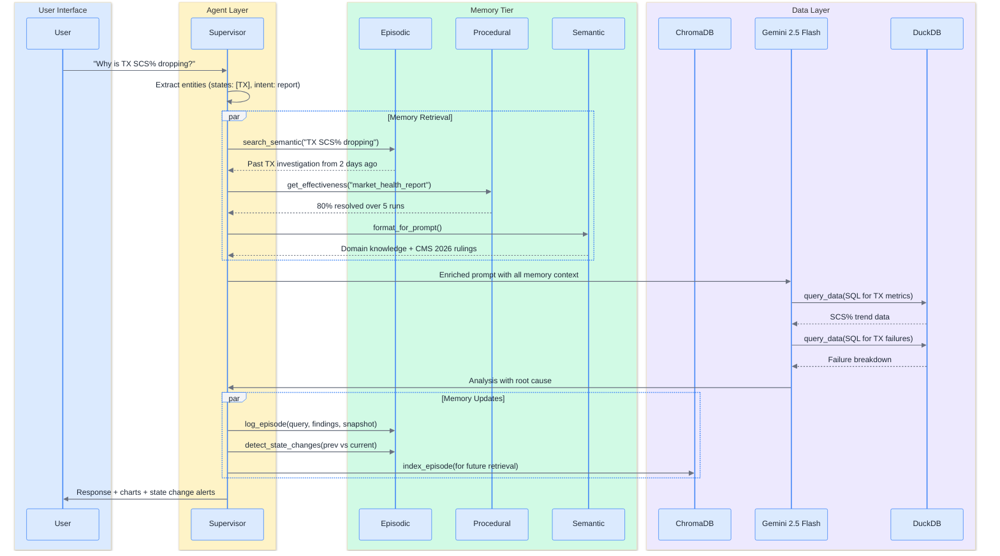
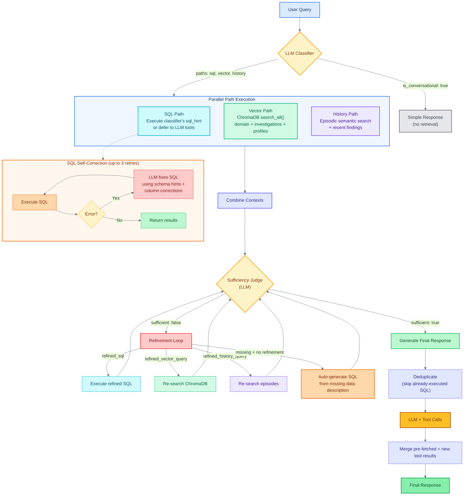

# RosterIQ — AI-Powered Healthcare Roster Pipeline Intelligence

RosterIQ is an AI agent that monitors, diagnoses, and explains healthcare provider roster processing pipelines. It combines structured SQL analytics with semantic retrieval, three-tier memory architecture, and LLM-driven reasoning to surface stuck ROs, failing markets, retry inefficiencies, and compliance risks — then remembers what it found for next time.


**Team Name:**  Zopita  , **Team Members:**   [Pradipta Sundar Sahoo](https://github.com/Pradipta-Sundar-Sahoo)  , [Dhruv Khandelwal](https://github.com/dhruv-k1)


---

## Table of Contents

- [Problem Statement](#problem-statement)
- [Architecture Overview](#architecture-overview)
- [Agent Tools](#agent-tools)
- [Data Preprocessing Pipeline](#data-preprocessing-pipeline)
- [Three-Tier Memory System](#three-tier-memory-system)
- [Multi-Path Query Pipeline](#multi-path-query-pipeline)
- [Key Design Decisions](#key-design-decisions)
- [Tech Stack](#tech-stack)
- [Project Structure](#project-structure)
- [Getting Started](#getting-started)
- [API Reference](#api-reference)
- [Frontend Pages](#frontend-pages)

---

## Problem Statement

Healthcare payers receive thousands of provider roster files monthly from different source systems (AvailityPDM, DPE, PDM, etc.). Each file passes through a **7-stage processing pipeline**:

```
INGESTION → PRE_PROCESSING → MAPPING_APPROVAL → ISF_GENERATION → DART_GENERATION → DART_REVIEW → DART_UI_VALIDATION → SPS_LOAD → RESOLVED
```

Files can get **stuck**, **fail validation**, or **degrade market SCS%** (Success Rate). Operators need to:
- Triage stuck ROs by priority
- Identify root causes of failures (data quality? compliance? timeout?)
- Track market health trends over time
- Understand retry effectiveness
- Correlate failures with LOB type (Medicare HMO vs Commercial PPO)
- Remember past investigations to avoid redundant work

RosterIQ automates all of this through conversational AI with persistent memory.

---

## Architecture Overview

### High-Level Architecture (Mermaid)

```mermaid
%%{init: {'theme': 'base', 'themeVariables': {'primaryColor': '#DBEAFE', 'background': '#FFFFFF', 'mainBkg': '#FFFFFF', 'lineColor': '#6B7280', 'textColor': '#1F2937'}}}%%
graph TB
    subgraph Frontend["Frontend (Next.js 16 + React 19)"]
        Chat["/chat — Conversational AI"]
        Dashboard["/dashboard — Pipeline Overview"]
        MemoryUI["/memory — Memory Browser"]
    end

    subgraph Backend["Backend (FastAPI)"]
        Supervisor["Supervisor Agent"]
        Pipeline["Query Pipeline"]
        PipelineAgent["Pipeline Agent<br/>(Triage / Health)"]
        QualityAgent["Quality Agent<br/>(Failures / Metrics)"]
        Formatter["Formatter Agent"]
        LLMProvider["LLM Provider<br/>(Gemini 2.5 Flash)"]
    end

    subgraph Memory["Three-Tier Memory"]
        Episodic["Episodic Memory<br/>(SQLite + Embeddings)"]
        Procedural["Procedural Memory<br/>(JSON Procedures)"]
        Semantic["Semantic Memory<br/>(YAML Domain Knowledge)"]
    end

    subgraph Tools["Agent Tools"]
        T1["query_data<br/>(DuckDB SQL)"]
        T2["web_search<br/>(Tavily)"]
        T3["run_procedure"]
        T4["create_chart<br/>(Plotly)"]
        T5["recall_memory"]
        T6["update_procedure"]
        T7["update_semantic_knowledge"]
    end

    subgraph Data["Data Layer"]
        DuckDB["DuckDB (In-Memory)"]
        ChromaDB["ChromaDB (Vector Store)"]
        Tavily["Tavily Web Search"]
    end

    subgraph DataSources["Raw Data"]
        CSV1["roster_processing_details.csv"]
        CSV2["aggregated_operational_metrics.csv"]
    end

    Chat --> Supervisor
    Dashboard --> Supervisor
    Supervisor --> Pipeline
    Supervisor --> PipelineAgent
    Supervisor --> QualityAgent
    Pipeline --> LLMProvider
    PipelineAgent --> LLMProvider
    QualityAgent --> LLMProvider
    LLMProvider --> Formatter

    Supervisor --> Episodic
    Supervisor --> Procedural
    Supervisor --> Semantic
    Pipeline --> ChromaDB
    Pipeline --> Episodic

    PipelineAgent --> T1
    PipelineAgent --> T3
    PipelineAgent --> T4
    QualityAgent --> T1
    QualityAgent --> T2
    QualityAgent --> T3
    QualityAgent --> T4
    QualityAgent --> T7
    Pipeline --> T1
    Supervisor --> T1
    Supervisor --> T2
    Supervisor --> T3
    Supervisor --> T4
    Supervisor --> T5
    Supervisor --> T6
    Supervisor --> T7

    T1 --> DuckDB
    T2 --> Tavily
    T3 --> Procedural
    T5 --> Episodic
    T6 --> Procedural
    T7 --> Semantic

    Supervisor --> DuckDB
    Supervisor --> Tavily
    CSV1 --> DuckDB
    CSV2 --> DuckDB
    Semantic --> ChromaDB

    style Frontend fill:#DBEAFE,stroke:#3B82F6,stroke-width:2px,color:#1E3A5F
    style Backend fill:#FEF3C7,stroke:#F59E0B,stroke-width:2px,color:#78350F
    style Memory fill:#D1FAE5,stroke:#10B981,stroke-width:2px,color:#065F46
    style Tools fill:#E0E7FF,stroke:#6366F1,stroke-width:2px,color:#312E81
    style Data fill:#EDE9FE,stroke:#8B5CF6,stroke-width:2px,color:#4C1D95
    style DataSources fill:#FEE2E2,stroke:#EF4444,stroke-width:2px,color:#7F1D1D

    style Chat fill:#93C5FD,stroke:#2563EB,color:#1E3A5F
    style Dashboard fill:#93C5FD,stroke:#2563EB,color:#1E3A5F
    style MemoryUI fill:#93C5FD,stroke:#2563EB,color:#1E3A5F

    style Supervisor fill:#FDE68A,stroke:#D97706,color:#78350F
    style Pipeline fill:#FDE68A,stroke:#D97706,color:#78350F
    style PipelineAgent fill:#FDE68A,stroke:#D97706,color:#78350F
    style QualityAgent fill:#FDE68A,stroke:#D97706,color:#78350F
    style Formatter fill:#FDE68A,stroke:#D97706,color:#78350F
    style LLMProvider fill:#FBBF24,stroke:#B45309,color:#78350F

    style Episodic fill:#6EE7B7,stroke:#059669,color:#065F46
    style Procedural fill:#6EE7B7,stroke:#059669,color:#065F46
    style Semantic fill:#6EE7B7,stroke:#059669,color:#065F46

    style T1 fill:#E0E7FF,stroke:#6366F1,color:#312E81
    style T2 fill:#E0E7FF,stroke:#6366F1,color:#312E81
    style T3 fill:#E0E7FF,stroke:#6366F1,color:#312E81
    style T4 fill:#E0E7FF,stroke:#6366F1,color:#312E81
    style T5 fill:#E0E7FF,stroke:#6366F1,color:#312E81
    style T6 fill:#E0E7FF,stroke:#6366F1,color:#312E81
    style T7 fill:#E0E7FF,stroke:#6366F1,color:#312E81

    style DuckDB fill:#C4B5FD,stroke:#7C3AED,color:#4C1D95
    style ChromaDB fill:#C4B5FD,stroke:#7C3AED,color:#4C1D95
    style Tavily fill:#C4B5FD,stroke:#7C3AED,color:#4C1D95

    style CSV1 fill:#FCA5A5,stroke:#DC2626,color:#7F1D1D
    style CSV2 fill:#FCA5A5,stroke:#DC2626,color:#7F1D1D
```



### Agent Routing (Mermaid)

```mermaid
%%{init: {'theme': 'base', 'themeVariables': {'primaryColor': '#DBEAFE', 'background': '#FFFFFF', 'mainBkg': '#FFFFFF', 'lineColor': '#6B7280', 'textColor': '#1F2937'}}}%%
flowchart LR
    Query["User Query"] --> Supervisor["Supervisor"]
    Supervisor --> Extract["Entity Extraction<br/>(Regex)"]
    Extract --> Intent{"Intent?"}

    Intent -->|triage / stuck| PA["Pipeline Agent"]
    Intent -->|audit / report / analysis| QA["Quality Agent"]
    Intent -->|general / other| QP["Query Pipeline"]

    PA --> PATools["Tools: query_data, run_procedure, create_chart"]
    QA --> QATools["Tools: query_data, run_procedure, create_chart, web_search, update_semantic_knowledge"]
    QP --> Classify["Classify Paths"]

    Classify --> SQL["SQL Path"]
    Classify --> Vector["Vector Path"]
    Classify --> History["History Path"]

    SQL --> Combine["Combine Contexts"]
    Vector --> Combine
    History --> Combine

    Combine --> Judge{"Sufficient?"}
    Judge -->|No| Refine["Refine<br/>(up to 3 loops)"]
    Refine --> Judge
    Judge -->|Yes| Generate["Generate Response"]

    PATools --> Format["Formatter Agent"]
    QATools --> Format
    Generate --> Format
    Format --> Response["Final Response<br/>+ Charts + Memory Update"]

    style Query fill:#DBEAFE,stroke:#3B82F6,stroke-width:2px,color:#1E3A5F
    style Supervisor fill:#FDE68A,stroke:#D97706,stroke-width:2px,color:#78350F
    style Extract fill:#E0E7FF,stroke:#6366F1,stroke-width:2px,color:#312E81
    style Intent fill:#FEF3C7,stroke:#F59E0B,stroke-width:2px,color:#78350F

    style PA fill:#FECACA,stroke:#EF4444,stroke-width:2px,color:#7F1D1D
    style QA fill:#FED7AA,stroke:#F97316,stroke-width:2px,color:#7C2D12
    style QP fill:#FDE68A,stroke:#EAB308,stroke-width:2px,color:#713F12

    style PATools fill:#E0E7FF,stroke:#6366F1,stroke-width:2px,color:#312E81
    style QATools fill:#E0E7FF,stroke:#6366F1,stroke-width:2px,color:#312E81
    style Classify fill:#FEF9C3,stroke:#CA8A04,stroke-width:2px,color:#713F12

    style SQL fill:#CFFAFE,stroke:#06B6D4,stroke-width:2px,color:#164E63
    style Vector fill:#D1FAE5,stroke:#10B981,stroke-width:2px,color:#065F46
    style History fill:#EDE9FE,stroke:#8B5CF6,stroke-width:2px,color:#4C1D95

    style Combine fill:#E0E7FF,stroke:#6366F1,stroke-width:2px,color:#312E81
    style Judge fill:#FEF3C7,stroke:#F59E0B,stroke-width:2px,color:#78350F
    style Refine fill:#FECACA,stroke:#EF4444,stroke-width:2px,color:#7F1D1D
    style Generate fill:#BBF7D0,stroke:#22C55E,stroke-width:2px,color:#14532D
    style Format fill:#FDE68A,stroke:#EAB308,stroke-width:2px,color:#713F12
    style Response fill:#86EFAC,stroke:#16A34A,stroke-width:2px,color:#14532D
```



### Agent Tools

| Tool | Purpose | Used By |
|------|---------|---------|
| `query_data` | Execute DuckDB SQL (with self-correction) | Pipeline Agent, Quality Agent, Query Pipeline, Supervisor |
| `web_search` | Search web for regulatory, org, compliance context | Quality Agent, Supervisor |
| `run_procedure` | Run diagnostic procedure (triage, audit, market health, etc.) | Pipeline Agent, Quality Agent, Supervisor |
| `create_chart` | Generate Plotly chart (heatmap, trend, breakdown, stuck tracker, etc.) | Pipeline Agent, Quality Agent, Supervisor |
| `recall_memory` | Search episodic memory for past investigations | Supervisor |
| `update_procedure` | Add or modify procedure steps from user feedback | Supervisor |
| `update_semantic_knowledge` | Persist regulatory/compliance insights from web search | Quality Agent, Supervisor |

---

## Data Preprocessing Pipeline

Raw CSVs are loaded into DuckDB at startup and enriched through a multi-step preprocessing pipeline.

### Preprocessing Flow (Mermaid)

```mermaid
%%{init: {'theme': 'base', 'themeVariables': {'primaryColor': '#DBEAFE', 'background': '#FFFFFF', 'mainBkg': '#FFFFFF', 'lineColor': '#6B7280', 'textColor': '#1F2937'}}}%%
flowchart TD
    subgraph Raw["Step 1: Load Raw CSVs"]
        R1["roster_processing_details.csv → raw_roster"]
        R2["aggregated_operational_metrics.csv → raw_metrics"]
    end

    subgraph Normalize["Step 2: Normalize & Standardize"]
        N1["Column Renames<br/>AVG_DART_GENERATION_DURATION → AVG_DART_GEN_DURATION<br/>AVG_ISF_GENERATION_DURATION → AVG_ISF_GEN_DURATION<br/>AVG_DART_UI_VLDTN_DURATION → AVG_DART_UI_VALIDATION_DURATION"]
        N2["Categorical Normalization<br/>Health flags → UPPERCASE<br/>FAILURE_STATUS → UPPER + TRIM<br/>Stage names: DART_GENERATION → DART_GEN"]
        N3["Type Casting<br/>FILE_STATUS_CD → INTEGER"]
    end

    subgraph Enrich["Step 3: Feature Engineering"]
        E1["Priority Scoring<br/>CRITICAL: DAYS_STUCK > 90 AND RED_COUNT >= 2<br/>HIGH: DAYS_STUCK > 30 OR RED_COUNT >= 2<br/>MEDIUM: DAYS_STUCK > 7<br/>LOW: everything else"]
        E2["LOB Decomposition<br/>LOB_PRIMARY, LOB_CATEGORIES, LOB_COUNT<br/>LOB_PLAN_TYPE (HMO/PPO/EPO/FFS/MIXED)<br/>LOB_COMPLIANCE_RISK (HIGHEST→LOW)<br/>HAS_MEDICARE, HAS_MEDICAID, HAS_COMMERCIAL"]
        E3["Failure Classification<br/>FAILURE_CATEGORY:<br/>VALIDATION / TIMEOUT / PROCESSING<br/>COMPLIANCE / OTHER / NONE"]
        E4["Health Aggregation<br/>RED_COUNT, YELLOW_COUNT across 7 stages<br/>HEALTH_SCORE (GREEN=2, YELLOW=1, RED=0)<br/>WORST_HEALTH_STAGE (first RED stage)"]
        E5["Pipeline Ordering<br/>PIPELINE_STAGE_ORDER: PRE_PROCESSING=0 → SPS_LOAD=6"]
        E6["Metrics Enrichment<br/>RETRY_LIFT_PCT, OVERALL_FAIL_RATE<br/>FIRST_ITER_FAIL_RATE, IS_BELOW_SLA<br/>MONTH_DATE (parsed from MM-YYYY)"]
    end

    subgraph Summary["Step 4: Summary Tables"]
        S1["state_summary<br/>Per-state: total ROs, stuck, failed,<br/>failure rate, avg days stuck,<br/>critical count, top failing org"]
        S2["org_summary<br/>Per (org, state): total ROs, stuck,<br/>failed, failure rate, health score"]
        S3["stage_health_summary<br/>Per pipeline stage: RED/YELLOW/GREEN<br/>counts, stuck-in-stage count"]
    end

    Raw --> Normalize --> Enrich --> Summary

    Summary --> Schema["Build Schema Cache<br/>(for LLM prompt injection)"]
    Summary --> VectorIndex["Index into ChromaDB<br/>(roster_profiles collection)"]

    style Raw fill:#FEE2E2,stroke:#EF4444,stroke-width:2px,color:#7F1D1D
    style Normalize fill:#FEF3C7,stroke:#F59E0B,stroke-width:2px,color:#78350F
    style Enrich fill:#DBEAFE,stroke:#3B82F6,stroke-width:2px,color:#1E3A5F
    style Summary fill:#D1FAE5,stroke:#10B981,stroke-width:2px,color:#065F46

    style R1 fill:#FCA5A5,stroke:#DC2626,color:#7F1D1D
    style R2 fill:#FCA5A5,stroke:#DC2626,color:#7F1D1D

    style N1 fill:#FDE68A,stroke:#D97706,color:#78350F
    style N2 fill:#FDE68A,stroke:#D97706,color:#78350F
    style N3 fill:#FDE68A,stroke:#D97706,color:#78350F

    style E1 fill:#93C5FD,stroke:#2563EB,color:#1E3A5F
    style E2 fill:#93C5FD,stroke:#2563EB,color:#1E3A5F
    style E3 fill:#93C5FD,stroke:#2563EB,color:#1E3A5F
    style E4 fill:#93C5FD,stroke:#2563EB,color:#1E3A5F
    style E5 fill:#93C5FD,stroke:#2563EB,color:#1E3A5F
    style E6 fill:#93C5FD,stroke:#2563EB,color:#1E3A5F

    style S1 fill:#6EE7B7,stroke:#059669,color:#065F46
    style S2 fill:#6EE7B7,stroke:#059669,color:#065F46
    style S3 fill:#6EE7B7,stroke:#059669,color:#065F46

    style Schema fill:#EDE9FE,stroke:#8B5CF6,stroke-width:2px,color:#4C1D95
    style VectorIndex fill:#EDE9FE,stroke:#8B5CF6,stroke-width:2px,color:#4C1D95
```



### What Each Enriched Column Means

| Column | Source Logic | Purpose |
|--------|-------------|---------|
| `PRIORITY` | `DAYS_STUCK` + `RED_COUNT` thresholds | Triage ranking for stuck ROs |
| `IS_RETRY` | `RUN_NO > 1` | Identify reprocessed files |
| `LOB_PRIMARY` | First token of comma-split LOB | Quick LOB categorization |
| `LOB_PLAN_TYPE` | Pattern match HMO/PPO/EPO/FFS | Plan structure classification |
| `LOB_COMPLIANCE_RISK` | Medicare HMO = HIGHEST, Commercial = LOW | Regulatory risk ranking |
| `FAILURE_CATEGORY` | Keyword match on `FAILURE_STATUS` | Structured failure taxonomy |
| `RED_COUNT` | Sum of RED health flags across 7 stages | Stage-level problem density |
| `HEALTH_SCORE` | GREEN=2, YELLOW=1, RED=0, summed | Overall health ranking (0-14) |
| `WORST_HEALTH_STAGE` | First RED stage (end-of-pipeline first) | Bottleneck identification |
| `PIPELINE_STAGE_ORDER` | Ordinal 0-7 | Enables stage progression analysis |
| `RETRY_LIFT_PCT` | `(NEXT_ITER - FIRST_ITER) / FIRST_ITER × 100` | Retry effectiveness measure |
| `IS_BELOW_SLA` | `SCS_PERCENT < 95` | SLA violation flag |

---

## Three-Tier Memory System

RosterIQ implements a **cognitive memory architecture** inspired by human memory systems. Each tier serves a distinct purpose and improves output quality over time.

### Memory Architecture (Mermaid)



### How Memory Improves Query Outputs

#### 1. Episodic Memory — "What did we find before?"

| Mechanism | How It Helps |
|-----------|-------------|
| **Semantic search over past episodes** | When a user asks "What's happening in Texas?", the system finds past TX investigations using Gemini embeddings (cosine similarity × importance weighting), avoiding redundant SQL queries |
| **Data snapshots** | Every episode stores a full state snapshot (stuck ROs by state, SCS% by market, top failing orgs). Session briefings compare current vs previous snapshots to detect changes ("3 stuck ROs resolved in TX since last session") |
| **Importance scoring** | Episodes involving web searches, procedures, or critical findings score higher (0.0–1.0), ensuring important investigations surface first |
| **Consolidation** | Episodes older than 30 days are LLM-summarized into digests, keeping search fast while retaining long-term patterns |

#### 2. Procedural Memory — "What workflow should I follow?"

| Mechanism | How It Helps |
|-----------|-------------|
| **Versioned procedures** | Diagnostic playbooks (e.g., `triage_stuck_ros`) with step-by-step SQL queries and analysis logic. Users can modify steps, and the system tracks version history |
| **Effectiveness tracking** | Each procedure execution is logged with outcome (resolved/unresolved/escalated). The system reports "triage_stuck_ros: 67% resolved over 12 runs" in the prompt, helping the LLM decide whether to recommend a procedure |
| **User-editable steps** | Procedures evolve based on user feedback. If a user says "also check LOB compliance risk during triage", the system adds a step and increments the version |

#### 3. Semantic Memory — "What does this term mean?"

| Mechanism | How It Helps |
|-----------|-------------|
| **Domain knowledge injection** | Pipeline stage descriptions, failure status meanings, LOB compliance hierarchies, and source system info are injected into every LLM prompt. The model knows "RED health = duration >2x average" without being told each time |
| **Runtime learning** | When web search discovers new regulatory info (e.g., "CMS CY 2026 changes"), the `update_semantic_knowledge` tool persists it to YAML. Future queries automatically include this context |
| **Cross-table relationships** | Semantic memory stores how tables relate (CNT_STATE ↔ MARKET, RUN_NO ↔ retry attempts), reducing SQL errors |

### Memory Interaction During a Query



---

## Multi-Path Query Pipeline

The query pipeline classifies each query and routes it through parallel retrieval paths before generating a response.

### Pipeline Flow



### ChromaDB Collections

| Collection | Contents | Indexed From | Purpose |
|-----------|----------|-------------|---------|
| `domain_knowledge` | Pipeline stages, failure statuses, LOB meanings, health flags, source systems, status codes, data notes | `semantic_knowledge.yaml` | Semantic search over domain concepts |
| `investigation_history` | Past query + findings pairs | Episodic memory (on each episode) | Find similar past investigations |
| `roster_profiles` | Org-level summaries (total ROs, failure rate, health score per org × state) | `org_summary` table | Natural language org lookup |

---

## Key Design Decisions

Every technology and pattern in RosterIQ was chosen to minimise LLM errors and maximise reliability. Below is a summary of each decision and its rationale.

### Why DuckDB (Not Pandas or SQLite)

LLMs generate SQL far more reliably than Pandas code — SQL is declarative, heavily represented in training data, and less prone to method-name hallucination. DuckDB was chosen over SQLite because it provides analytical SQL features critical to our preprocessing: `LIST_TRANSFORM`, `STRING_SPLIT`, `ILIKE`, and `CREATE TABLE AS SELECT` with complex subqueries. In-memory mode (`:memory:`) means zero infrastructure — DuckDB runs as a library inside the FastAPI process with sub-millisecond query latency. We reload from CSVs on every restart so preprocessing logic changes don't require migrations.

### Why Feature Engineering at Preprocessing Time

This is the single most impactful decision for LLM accuracy. When asking Gemini to generate complex inline SQL derivations (multi-branch `CASE WHEN`, LOB string decomposition, 7-column health aggregation), it failed 40-60% of the time. By precomputing 15+ enriched columns (`PRIORITY`, `FAILURE_CATEGORY`, `HEALTH_SCORE`, `LOB_COMPLIANCE_RISK`, `WORST_HEALTH_STAGE`, etc.) during DuckDB table creation, the LLM only needs to write simple `SELECT column FROM table WHERE column = 'value'` queries — which succeed ~90% on first attempt. Combined with SQL self-correction, effective accuracy reaches ~98%. Summary tables (`state_summary`, `org_summary`, `stage_health_summary`) eliminate aggregation errors entirely for common queries.

### Why the Refinement Loop (Up to 3 Iterations)

Single-shot retrieval fails for multi-faceted queries like "Why is TX SCS% dropping?" which needs metrics trends, failure breakdowns, episodic history, and possibly regulatory context. Our pipeline classifies which retrieval paths to activate (SQL, vector, history), runs them in parallel, then a sufficiency judge evaluates if the gathered context can answer the question. If not, it generates targeted refinements — a corrected SQL query, a rephrased vector search, or a history query — up to 3 times. Empirically: 70% sufficient after pass 1, 90% after pass 2, 97% after pass 3. Beyond 3 yields diminishing returns.

### Why SQL Self-Correction (Not Blind Retry)

The most common LLM SQL failure is wrong column names (`FAILURE_TYPE` instead of `FAILURE_CATEGORY`). Retrying the same prompt produces the same error. Our self-correction mechanism extracts schema hints and fuzzy-matched column corrections from the error, sends them with the full schema to the LLM, and gets a corrected query. Up to 3 attempts, after which the pipeline proceeds with available context.

### Why SQLite for Episodic Memory (Not ChromaDB Alone)

Episodic memory requires both structured queries (filter by session, timestamp ranges, `GROUP BY` for session listing, `COUNT(*)` for consolidation triggers) and semantic search. ChromaDB can't do relational queries. Our hybrid: SQLite handles all structured operations; Gemini `text-embedding-004` embeddings stored as JSON enable cosine-similarity search in Python. Ranking formula: `cosine_similarity × 0.7 + importance_score × 0.3`.

### Why ChromaDB with 3 Separate Collections

`domain_knowledge` (static domain concepts from YAML), `investigation_history` (growing with every query), and `roster_profiles` (org summaries rebuilt at startup) have different update patterns and document types. Merging them would mix pipeline stage descriptions with past investigation findings with org statistics, degrading search relevance. Separate collections ensure each `search_all()` call returns focused, type-appropriate results.

### Why Regex Entity Extraction (Not LLM-Based)

Regex takes <1ms vs 800-1500ms for LLM extraction. It's deterministic — never hallucinates entities. Our entity space is bounded: 50 US state codes, RO IDs matching `RO-\d+`, 6 procedure names, and intent keywords. Regex handles all of these with 100% precision. We kept LLM extraction as dead code for potential future use with unbounded entity types.

### Why Multi-Agent (Supervisor + Specialists)

A single agent with all 7 tool definitions + full schema + semantic knowledge + episodic context = 8000+ token system prompts, causing the LLM to ignore parts and confuse tools. Splitting into a Supervisor (routing), Pipeline Agent (stuck ROs, triage), Quality Agent (failures, metrics), and Query Pipeline (general queries) gives each agent a focused ~2000-token prompt. The Formatter Agent ensures consistent output quality regardless of which specialist produced the analysis.

### Why Dynamic Schema Injection

If preprocessing adds a column (e.g., `LOB_COMPLIANCE_RISK`) but the prompt schema is hardcoded, the LLM won't know it exists and will try to compute it inline — defeating preprocessing. `schema_provider.py` dynamically queries DuckDB's `DESCRIBE` at startup and injects the current schema (table names, column names, types, sample values) into every prompt. Schema always stays in sync with preprocessing.

---

## Tech Stack

| Layer | Technology | Purpose |
|-------|-----------|---------|
| **LLM** | Google Gemini 2.5 Flash | Reasoning, classification, SQL generation, response formatting |
| **Embeddings** | Gemini `text-embedding-004` | Episodic memory semantic search |
| **Backend** | FastAPI + Uvicorn | REST API server |
| **Analytical DB** | DuckDB (in-memory) | Sub-second SQL on roster + metrics data |
| **Vector DB** | ChromaDB (persistent) | Semantic retrieval over domain knowledge, investigations, profiles |
| **Episodic Store** | SQLite | Past investigations, state changes, digests |
| **Web Search** | Tavily API | Regulatory context, org info, compliance updates |
| **Charts** | Plotly.js | Heatmaps, trend lines, failure breakdowns, stuck trackers |
| **Frontend** | Next.js 16, React 19, Tailwind, shadcn/ui, Framer Motion | Chat UI, dashboard, memory browser |
| **Deployment** | Docker Compose | Two-container setup (backend:8000, frontend:3000) |

---

## Project Structure

```
Roaster-IQ/
├── backend/
│   ├── main.py                     # FastAPI app, routes, lifespan initialization
│   ├── data_loader.py              # CSV → DuckDB preprocessing pipeline
│   ├── query_pipeline.py           # Multi-path classify → route → judge → generate
│   ├── vector_store.py             # ChromaDB wrapper (3 collections)
│   ├── schema_provider.py          # Dynamic schema injection for LLM prompts
│   ├── prompts.py                  # Supervisor / agent system prompts
│   ├── prompts_pipeline.py         # Classifier + sufficiency judge prompts
│   ├── requirements.txt
│   ├── agents/
│   │   ├── supervisor.py           # Main orchestrator — routing, memory, tools
│   │   ├── pipeline_agent.py       # Specialized: stuck ROs, pipeline health
│   │   ├── quality_agent.py        # Specialized: failures, market metrics
│   │   ├── formatter_agent.py      # Final response cleanup
│   │   └── llm_provider.py         # Gemini function-calling wrapper
│   ├── memory/
│   │   ├── episodic.py             # SQLite + embeddings episodic store
│   │   ├── procedural.py           # JSON versioned procedures
│   │   └── semantic.py             # YAML domain knowledge
│   ├── tools/
│   │   ├── data_query.py           # DuckDB SQL execution + schema hints
│   │   ├── visualizations.py       # Plotly chart generators
│   │   ├── web_search.py           # Tavily search (regulatory, org, compliance)
│   │   └── report_generator.py     # State/org report builder
│   └── procedures/
│       └── engine.py               # Procedure step executor
├── frontend/
│   ├── app/
│   │   ├── page.tsx                # Redirect → /chat
│   │   ├── layout.tsx              # Root layout + sidebar
│   │   ├── chat/page.tsx           # Main conversational interface
│   │   ├── dashboard/page.tsx      # Pipeline overview + charts + alerts
│   │   └── memory/page.tsx         # Episodic / procedural / semantic browser
│   ├── components/
│   │   ├── charts/PlotlyChart.tsx   # Plotly JSON renderer
│   │   ├── layout/Sidebar.tsx       # Navigation sidebar
│   │   └── ui/                      # shadcn component library
│   └── lib/api.ts                   # API client (fetch wrapper)
├── memory/
│   ├── procedures.json              # Procedure definitions (versioned)
│   ├── semantic_knowledge.yaml      # Domain knowledge base
│   ├── episodic.db                  # SQLite runtime database
│   └── chroma_db/                   # ChromaDB persistence directory
├── data/
│   ├── roster_processing_details.csv
│   └── aggregated_operational_metrics.csv
├── docker-compose.yml
└── .env                             # GEMINI_API_KEY, TAVILY_API_KEY
```

---

## Getting Started

### Prerequisites

- Python 3.11+
- Node.js 18+
- Google Gemini API key
- Tavily API key (optional, for web search)

### Environment Setup

```bash
# Clone and navigate
cd Roaster-IQ

# Copy the example env and fill in your keys
cp .env.example .env
# Then edit .env with your actual API keys
```

### Option 1: Docker Compose

```bash
docker-compose up --build
```

Backend: `http://localhost:8000` | Frontend: `http://localhost:3000`

### Option 2: Local Development

```bash
# Backend
cd backend
pip install -r requirements.txt
uvicorn main:app --reload --port 8000

# Frontend (separate terminal)
cd frontend
npm install
npm run dev
```

---

## API Reference

| Method | Endpoint | Description |
|--------|----------|-------------|
| `POST` | `/chat` | Send a query, get AI response + charts |
| `GET` | `/session/briefing` | Session briefing (state change detection) |
| `GET` | `/memory/episodic` | Browse past investigations |
| `GET` | `/memory/procedural` | View diagnostic procedures |
| `GET` | `/memory/semantic` | View domain knowledge |
| `PUT` | `/memory/procedural/{name}` | Update a procedure |
| `POST` | `/memory/procedural` | Create a new procedure |
| `GET` | `/dashboard/overview` | Pipeline health overview |
| `GET` | `/dashboard/charts/{type}` | Generate specific chart |
| `GET` | `/dashboard/alerts` | Proactive monitoring alerts |
| `GET` | `/dashboard/intelligence` | AI-generated intelligence briefing |
| `POST` | `/procedure/{name}` | Execute a diagnostic procedure |
| `POST` | `/report/generate` | Generate state/org report |
| `GET` | `/alerts` | Current alert list |

---

## Frontend Pages

### `/chat` — Conversational AI
Natural language interface with suggested queries, slash commands (`/triage`, `/audit`, `/report`), inline chart rendering, and tool call transparency.

### `/dashboard` — Pipeline Overview
Real-time pipeline health: stuck RO counts, failure rates, SCS% trends, health heatmaps, proactive alerts with one-click procedure execution.

### `/memory` — Memory Browser
Three tabs (Episodic / Procedural / Semantic) for inspecting and editing the agent's memory. View past investigations, procedure version history, and domain knowledge entries.
